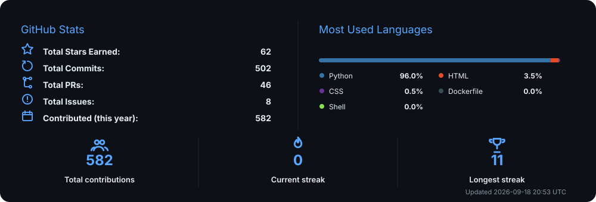

<div align="center">

# Minimal GitHub Stats

**Minimal, customizable GitHub profile statistics generated automatically with Python and GitHub Actions.**

No external statistics service. No server. No personal access token required.

[](https://github.com/antonisloukis/minimal-github-stats/actions/workflows/tests.yml)
[](https://www.python.org/)
[](https://github.com/features/actions)
[](LICENSE)

<br>



</div>

---

## Overview

Minimal GitHub Stats generates a clean SVG dashboard containing your:

- Total stars earned
- Total commits
- Total pull requests
- Total issues
- Contributions this year
- Total contributions
- Current contribution streak
- Longest contribution streak
- Most-used programming languages

The SVG is regenerated automatically every six hours using GitHub Actions and committed directly to your repository.

## Why use it?

Many GitHub statistics cards depend on an externally hosted service.

Minimal GitHub Stats runs entirely inside your own repository:

- No external card API
- No server deployment
- No personal access token
- No Python packages to install
- No tracking scripts
- No manual statistic updates
- No GitHub username hardcoded into the template

The generator uses Python's standard library and GitHub's automatically provided workflow token.

## Quick start

### 1. Create your repository

Click **Use this template** near the top of this repository.

Select:

```text
Create a new repository
```

A recommended repository name is:

```text
minimal-github-stats
```

The repository must be public if you want to display the generated SVG publicly on your GitHub profile.

### 2. Run the workflow

Open your new repository and go to:

```text
Actions
→ Update GitHub statistics
→ Run workflow
```

Keep the selected branch as `main`, then click the green **Run workflow** button.

The workflow will generate:

```text
assets/github-stats.svg
```

It will also update the SVG automatically every six hours.

### 3. Add the statistics to your profile

Open the `README.md` file inside your GitHub profile repository.

Your profile repository normally has the same name as your GitHub username:

```text
YOUR_USERNAME/YOUR_USERNAME
```

Add:

```html
<p align="center">
  
</p>
```

Replace:

```text
YOUR_USERNAME
```

with your real GitHub username.

Also replace:

```text
minimal-github-stats
```

when you selected a different repository name.

## Configuration

Most users only need to edit:

```text
config.json
```

The workflow automatically detects the repository owner, so no username setup is required.

Default configuration:

```json
{
  "output_path": "assets/github-stats.svg",
  "max_languages": 8,
  "exclude_languages": [],
  "theme": {
    "background": "#0d1117",
    "accent": "#58a6ff",
    "text": "#e6edf3",
    "muted": "#8b949e",
    "divider": "#21262d"
  },
  "labels": {
    "stats_title": "GitHub Stats",
    "languages_title": "Most Used Languages",
    "stars": "Total Stars Earned",
    "commits": "Total Commits",
    "pull_requests": "Total PRs",
    "issues": "Total Issues",
    "contributions_year": "Contributed (this year)",
    "total_contributions": "Total contributions",
    "current_streak": "Current streak",
    "longest_streak": "Longest streak"
  }
}
```


### Number of languages

Display between one and eight language entries:

```json
"max_languages": 8
```

Supported values:

```text
1–8
```

With eight entries, the language legend is displayed in two columns with four rows each.
When more languages exist than the configured limit, the remaining languages are grouped under `Other`.

### Exclude languages

Hide selected languages from the language bar:

```json
"exclude_languages": [
  "HTML",
  "CSS"
]
```

Language matching is case-insensitive.

### Change the colors

Example purple theme:

```json
"theme": {
  "background": "#0d1117",
  "accent": "#a371f7",
  "text": "#e6edf3",
  "muted": "#8b949e",
  "divider": "#21262d"
}
```

Example green theme:

```json
"theme": {
  "background": "#0d1117",
  "accent": "#3fb950",
  "text": "#e6edf3",
  "muted": "#8b949e",
  "divider": "#21262d"
}
```

Any valid SVG-compatible color value may be used.

### Change the text

The card's visible labels can be edited without modifying Python:

```json
"labels": {
  "stats_title": "Development Stats",
  "languages_title": "Language Usage",
  "stars": "Stars",
  "commits": "Commits",
  "pull_requests": "Pull Requests",
  "issues": "Issues",
  "contributions_year": "Contributions This Year",
  "total_contributions": "Total Contributions",
  "current_streak": "Current Streak",
  "longest_streak": "Longest Streak"
}
```

This also makes it possible to translate the card into another language.

## Automatic updates

The workflow runs:

```text
Every six hours
```

It can also run when one of these files changes:

```text
config.json
scripts/generate_stats.py
.github/workflows/update-stats.yml
```

A manual run is always available under the repository's **Actions** tab.

The generator calculates a fingerprint from the current statistics, configuration, and generator code. When nothing meaningful has changed, the existing SVG is left untouched and no unnecessary commit is created.

## Project structure

```text
minimal-github-stats/
├── .github/
│   └── workflows/
│       └── update-stats.yml
├── assets/
│   └── github-stats.svg
├── scripts/
│   └── generate_stats.py
├── config.json
├── .gitignore
├── LICENSE
└── README.md
```

## How it works

1. GitHub Actions starts the workflow.
2. GitHub creates a temporary repository token.
3. The Python generator queries GitHub's GraphQL API.
4. Public repositories and contribution data are processed.
5. Language sizes are combined across non-fork public repositories.
6. The SVG dashboard is generated.
7. The workflow commits the SVG only when its content has changed.

No permanent token is stored in the repository.

## Running locally

Local execution is optional.

### Requirements

- Python 3.10 or newer
- A GitHub token available in your local environment

Linux or macOS:

```bash
export GITHUB_TOKEN="your-token"
export GITHUB_USERNAME="your-username"

python scripts/generate_stats.py
```

PowerShell:

```powershell
$env:GITHUB_TOKEN="your-token"
$env:GITHUB_USERNAME="your-username"

python scripts/generate_stats.py
```

Do not commit personal access tokens to GitHub.

## Troubleshooting

### The workflow cannot push the SVG

Open:

```text
Settings
→ Actions
→ General
→ Workflow permissions
```

Select:

```text
Read and write permissions
```

Save the setting, then run the workflow again.

Repository or organization policies may prevent a workflow from receiving write permission even when the workflow declares `contents: write`.

### The workflow is not visible

Confirm that the file exists at exactly:

```text
.github/workflows/update-stats.yml
```

Also check that GitHub Actions is enabled for the repository.

### The SVG is not generated

Open the failed workflow run:

```text
Actions
→ Update GitHub statistics
→ Failed run
→ Generate statistics SVG
```

The error message will usually identify an invalid `config.json` value or a GitHub API problem.

### Only one language appears

The language panel is based on languages detected across your public, non-fork repositories.

Additional languages appear after repositories containing those languages become public and GitHub finishes processing their language statistics.

### My statistics did not change immediately

The workflow runs every six hours, but it can be started manually:

```text
Actions
→ Update GitHub statistics
→ Run workflow
```

GitHub may also take time to update contribution and language data.

### The card is too large in my profile

Change the width in your profile README:

```html

```

Recommended widths:

```text
100% — full width
95%  — slightly compact
90%  — compact
```

## License

Distributed under the [MIT License](LICENSE).

You may use, modify, and distribute this project in personal and commercial projects.

## Acknowledgements

Built with:

- Python
- GitHub GraphQL API
- GitHub Actions
- SVG

---

<div align="center">

Created by [Antonis Loukis](https://github.com/antonisloukis)

A star helps other developers discover the project.

</div>
